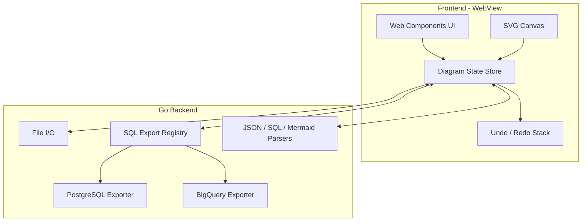

# ERD Tool – Detailed Plan

## 1. Technology Stack

**Recommendation: Wails (Go + Web frontend)**

- **Desktop**: Wails produces a single native binary (Windows/macOS/Linux), satisfies “backend in Go” and “desktop app.”
- **Frontend**: HTML, CSS, TypeScript, and Web Components run in the embedded WebView; no separate browser required.
- **Alternatives considered**: Electron (no Go backend), Tauri (Rust backend), Flet (Python; only if Go/Wails ruled out). Wails keeps one codebase, one binary, and Go for file I/O and SQL generation.

**Frontend stack**

- **UI**: Web Components (custom elements) for table cards, relationship lines, toolbar.
- **Diagram surface**: SVG for tables and relationship lines so pan/zoom and “lines follow tables” are straightforward (transform groups + pointer events).
- **State**: In-memory store (single source of truth) with undo/redo stacks; no framework required, or a minimal store pattern.
- **Build**: TypeScript compiled (e.g. esbuild or Vite) and served by Wails; output bound to `index.html` in the Wails app.

**Backend (Go)**

- File I/O: save/load custom JSON, import/export JSON/SQL/Mermaid.
- SQL export: pluggable by dialect (PostgreSQL, BigQuery); extensible for more dialects later.
- Optional: PNG/SVG export can be done in frontend (SVG/canvas → blob); Go can still handle “Save as file” and path dialogs via Wails bindings.

---

## 2. Application Architecture

- **Frontend**: User actions (add table/field, drag, connect, delete, layout) update the **Diagram State Store**. The store notifies the SVG canvas and toolbar; all mutations go through the store so **Undo/Redo** can record snapshots or inverse actions.
- **Backend**: Invoked via Wails bindings for: Load/Save/Import/Export. **SQL Export** is a registry of dialect-specific exporters (e.g. “postgres”, “bigquery”); each exporter receives the same in-memory schema and returns a string. **JSON/Mermaid/SQL import** parsers produce the same internal schema so the store can replace the current diagram.

**Modular SQL export (extensible)**

- Define a Go interface, e.g. `SQLExporter interface { Export(ctx, schema) (string, error); Dialect() string }`.
- Implementations: `PostgreSQLExporter` (CREATE TABLE with PRIMARY KEY / FOREIGN KEY), `BigQueryExporter` (CREATE TABLE with columns only; no PK/FK—optionally document relationships in comments or a separate doc).
- A small **registry** (map or factory) returns the exporter by dialect name; adding a new DB = new implementation and registration. Template-based generation (e.g. `text/template`) keeps DDL readable and maintainable.

---

## 3. JSON Storage Format (Diagram Schema)

A single JSON document that represents everything needed to restore the diagram and data.

**Proposed structure**

- `**version**`: number (e.g. `1`) for future migrations.
- `**tables**`: array of:
  - `id`: string (UUID or nanoid)
  - `name`: string
  - `x`, `y`: number (position on canvas)
  - `fields`: array of `{ id, name, type }` (id for linking relationships).
- `**relationships**`: array of:
  - `id`: string
  - `sourceTableId`, `sourceFieldId`: string
  - `targetTableId`, `targetFieldId`: string
  - optional: `label` or display name for the edge.
- `**viewport**` (optional): `{ zoom, panX, panY }` to restore zoom/pan.

All positions and relationship endpoints are stored so that Save/Load and Import/Export JSON are lossless. The same structure can be used as the in-memory model in the frontend and for serialization in Go.

---

## 4. User Interface Design

- **Toolbar** (top or side): **Add Table** | **Save** | **Load** | **Undo** | **Redo** | **Layout** (dropdown: Grid, Hierarchical, Force-directed) | **Export** (dropdown: JSON, SQL, Mermaid, PNG, SVG) | **Import** (dropdown: JSON, SQL, Mermaid).
- **Canvas**: One SVG root with a transform group for pan/zoom. Tables = grouped nodes (rect + text + field list); relationships = paths (e.g. Bezier or line segments) between field anchors. Background grid or plain; right-drag or middle-drag for pan; Ctrl+wheel for zoom.
- **Table card**: Header (table name, editable on double-click or via context menu), list of rows (field name, type), **Add Field** control, **Delete** on context menu. Single click = select table; drag = move table (relationship endpoints update in real time).
- **Relationships**: Draw by “connect mode”: click source field, then drag to target field (or table). Click on a line to select; context menu or inline: **Edit** (e.g. field names/labels), **Delete**.
- **Fields**: Click to select; double-click or context menu to **Edit** (name, type); context menu **Delete**. Field types can be a predefined list (e.g. TEXT, INT, UUID, TIMESTAMP) plus “Other” for custom.

**Export/Import flows**

- **Export SQL**: User picks dialect (PostgreSQL or BigQuery) from Export submenu; backend runs the corresponding exporter and opens “Save file” dialog.
- **Import SQL**: User selects file; backend parses DDL (simple parser or use an existing Go SQL parser for CREATE TABLE), infers tables/columns (and optionally relationships from FK/PG constraints); BigQuery DDL has no FK so only tables/columns are imported. Parsed result is converted to the internal JSON shape and loaded into the store.
- **PNG/SVG**: Frontend renders the current SVG (or a cloned/canvas version) and triggers download or passes blob to backend for file dialog.

---

## 5. User Experience Design

- **Selection**: Single selection for table, field, or relationship; clear visual state (outline/highlight). Deselect by clicking empty canvas or Escape.
- **Drag**: Tables draggable by header; relationship paths recompute on the same frame so lines “follow” tables. No drag on the canvas background when dragging a table (distinguish table drag from pan).
- **Pan/Zoom**: Pan by dragging empty canvas (or dedicated “hand” mode); zoom with Ctrl+wheel; optional zoom controls in toolbar. Zoom center on cursor for natural feel.
- **Layout**: “Layout” applies an algorithm to current positions: **Grid** (align to grid), **Hierarchical** (top-to-bottom by relationships, e.g. dagre-like), **Force-directed** (simulate forces so connected tables sit closer). Layout only moves tables; relationships redraw from new positions.
- **Keyboard**: Undo (Ctrl+Z), Redo (Ctrl+Shift+Z or Ctrl+Y); Delete key to delete selected table/field/relationship when focused.
- **Feedback**: Toasts or status line for “Saved”, “Loaded”, “Export ready”, and parse errors on Import.

---

## 6. Testing Strategy

- **Backend (Go)**
  - Unit tests for: JSON marshal/unmarshal of diagram schema, each SQL exporter (PostgreSQL, BigQuery) with fixture schemas, SQL/Mermaid/JSON import parsers.
  - Use table-driven tests and example DDL files (e.g. from `nyt_extstreams_prd_plato_prd_ddl.sql`) for import and round-trip.
- **Frontend**
  - Unit tests (e.g. Vitest) for: store logic (add/remove table/field/relationship, undo/redo), conversion from stored JSON to view model, layout helpers (grid position calculator).
  - Optional: component tests for Web Components (e.g. @open-wc/testing) to assert DOM and events.
- **E2E**
  - Optional: Playwright or similar against the Wails dev server to test “Add Table → Add Field → Connect → Save → Load” and “Export SQL (Postgres/BigQuery)”. Manual QA for pan/zoom and drag is acceptable for v1.

---

## 7. Deployment Strategy

- **Build**: Use Wails CLI (`wails build`) to produce a single binary per platform (Windows, macOS, Linux). Frontend assets are embedded.
- **Installers**: Wails supports or integrates with NSIS (Windows), and platform packaging for macOS/Linux; add installer targets as needed for distribution.
- **Updates**: No auto-update in scope for v1; document “replace binary” or “reinstall” for users. Optional later: version endpoint + download link or installer.

---

## 8. Key Implementation Notes

- **BigQuery vs PostgreSQL**: Exporters share the same in-memory schema. PostgreSQL: emit `PRIMARY KEY`, `REFERENCES` etc. BigQuery: emit `CREATE TABLE` with columns (and optional `PARTITION BY`/`CLUSTER BY` if you extend the model); relationships are diagram-only or comment-only.
- **Mermaid**: Export = traverse tables/relationships and output Mermaid ERD syntax. Import = parse Mermaid ERD (regex or a small parser) into tables and relationships; positions can be auto-assigned (e.g. grid).
- **Relationship lines**: Store by `(sourceTableId, sourceFieldId)` and `(targetTableId, targetFieldId)`. In SVG, compute endpoints from table positions + field row offsets; use quadratic Bezier or polyline for clean paths that avoid overlapping tables when possible.

---

## 9. Suggested Repo Structure (High Level)

- `frontend/` – TypeScript, Web Components, SVG canvas, store, layout utilities.
- `backend/` – Go: diagram model, file I/O, SQL export registry, PostgreSQL/BigQuery exporters, import parsers (JSON, SQL, Mermaid).
- `shared/` or `pkg/schema/` – Shared diagram structs (Go) and TypeScript types (or generated from Go) so frontend and backend agree on JSON shape.
- Wails project root: `main.go`, `wails.json`, build config; `frontend` output wired as app assets.

This keeps the ERD tool desktop-only, modular for SQL dialects, and centered on a clean JSON format that captures tables, fields, positions, and relationships for save/load and all import/export paths.
